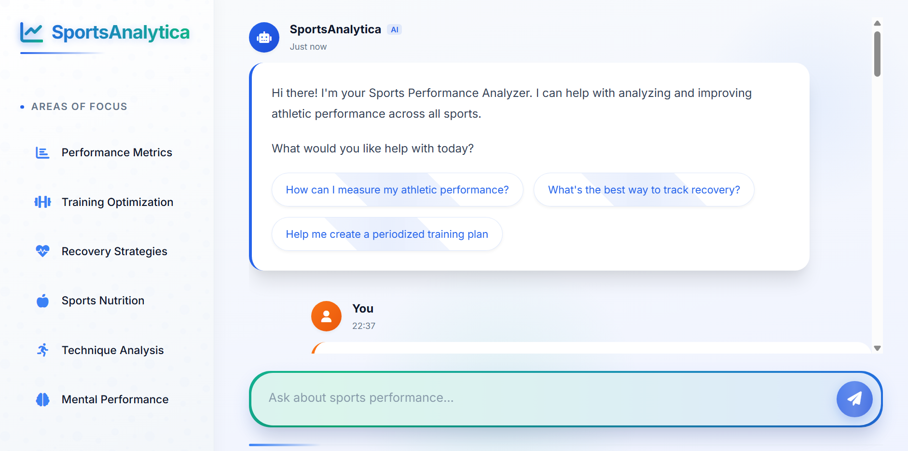
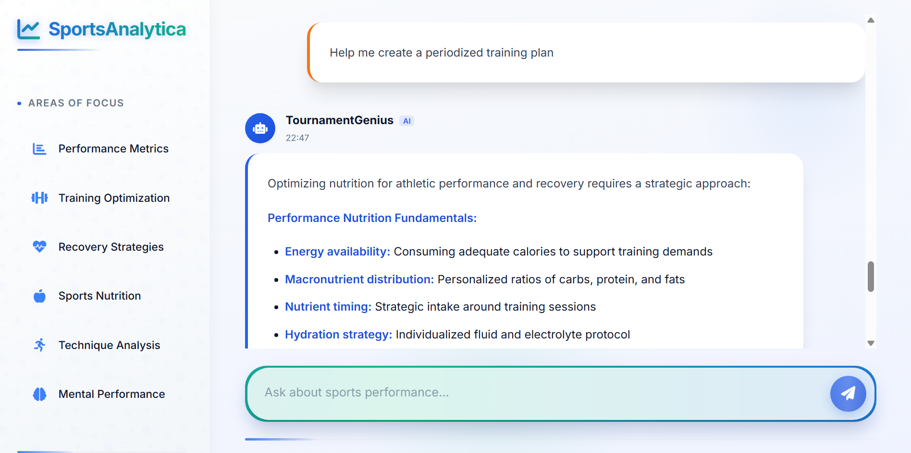

# SportsAnalytica

A specialized chatbot designed to help athletes and coaches analyze and improve sports performance. This chatbot uses Hugging Face's free API to provide domain-specific responses to sports performance-related queries.

## Screenshots




## Features

- Beautiful, modern UI with animated components
- Domain-specific responses for sports performance analysis
- Support for various performance metrics and training methodologies
- Recovery and nutrition guidance
- Sport-specific performance enhancement strategies
- Out-of-scope detection for non-sports-related queries
- **Free API Usage**: Uses Hugging Face's Inference API with free tier access

## Setup

1. Clone this repository
2. Install Python dependencies:
   ```
   pip install -r requirements.txt
   ```
3. Create a `.env` file in the root directory with your Hugging Face API key:
   ```
   PORT=3000
   HUGGINGFACE_API_KEY=your_huggingface_api_key_here
   ```
   Note: You can get a free API key by creating an account at [Hugging Face](https://huggingface.co)
   
4. Start the server:
   ```
   python app.py
   ```

## Usage

Once the server is running, open your browser and navigate to `http://localhost:3000`. You can interact with the chatbot through the web interface.

Example queries:
- "How can I improve my sprint speed?"
- "What metrics should I track for basketball performance?"
- "How do I optimize recovery between training sessions?"
- "What's the best way to periodize strength training for soccer?"

## Architecture

- **Frontend**: Modern HTML/CSS/JS interface with animations
- **Backend**: Flask server handling requests to the Hugging Face API
- **Domain Scope**: Specialized for sports performance analysis

## Technologies Used

- Python with Flask
- Hugging Face Inference API (Free Tier)
- Modern HTML5, CSS3, and JavaScript
- Font Awesome for icons 